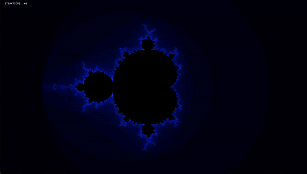
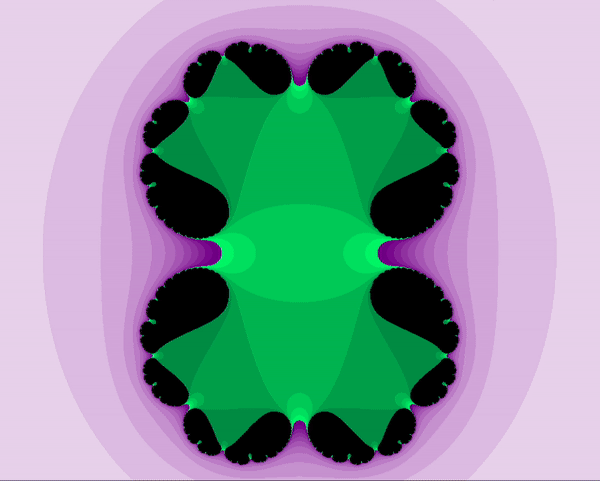
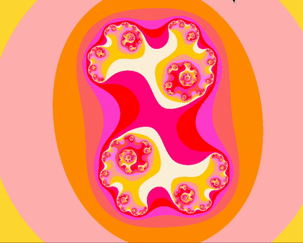

# 42_Fractol

42_Fractol is my project from 42's curriculum where we are first introduced to graphical programming through fractals. I thought fractals were an interesting topic to jump into due to the incredible depth of colors present in fractals and their almost infinite complexity. <br />
<br /> 
**Where do fractals come from?** <br />
<br /> 
Have you ever heard of complex numbers; those weird numbers that have a real and a complex part. Well if not, it's not that hard: basically when you plot numbers the x axis represent the real part and the y axis is the imaginary part. See, it's simple. <br />
<br /> 
Now let's go a bit deeper, all numbers when squared infinetely can eitheir become divergent meaning they tend to the infinite...they explode!<br /> 
<br /> 
2 becomes 4 becomes 16 becomes 256 becomes 65,536 ... :rocket::boom:<br />
<br /> 
Other numbers such as 0.5 for example, when squared infinitely will never surpass 2 as a value. I will let you do the maths. Those numbers are convergent. <br />
<br /> 
Now going back to fractals, a fractal is the graphical representation of all divergent points on a plot. If you want to learn more about this, check out [Mandelbrot Painter](https://www.geogebra.org/m/BUVhcRSv#material/XQprvGbW) 


Commands | Description | Fractals |
|---|---|---|
C | change color scheme | ALL |
F | change the constant's value for the Julia set | Julia |
'+' | add iterations to the counter (only work for large keyboards) | ALL |
'-' | minus iterations to the counter (only work for large keyboards) | ALL |
Arrow key UP | move up the fractal image | ALL |
W | move up the fractal image | ALL |
Arrow key DOWN | move down the fractal image | ALL |
S | move down the fractal image | ALL |
Arrow key LEFT | move left the fractal image | ALL |
A | move left the fractal image | ALL |
Arrow key RIGHT | move right the fractal image | ALL |
D | move right the fractal image | ALL |
ZOOM In (mouse/trackpad) | zooms in the fractal image following the mouse | ALL | 
ZOOM Out (mouse/trackpad) | zooms out the fractal image following the mouse | ALL | 

## Installation

```bash
git clone git@github.com:PGCL1/42_Fractol.git
cd 42_Fractol/mlx && make
cd .. && make
./fractol [fractal-name] [iterations]
```

> [!NOTE]  
> The Julia set can have two more params (see below): <br />
> ```bash
> ./fractol [fractal-name] [iterations] [complex-real] [complex-imaginary]
> ```

## Usage

```C
# returns 'Mandelbrot set'
./fractol Mandelbrot

# returns 'Mandelbrot set at 300 iterations'
./fractol Mandelbrot 30

# returns 'Julia set 0.285 0 at 30 iterations '
./fractol Julia 30 0.285 0
```
## Examples

### Pressing C to change fractal colors


### Pressing Plus or Minus to increment fractal iterations


### Pressing F to change Julia's constants

